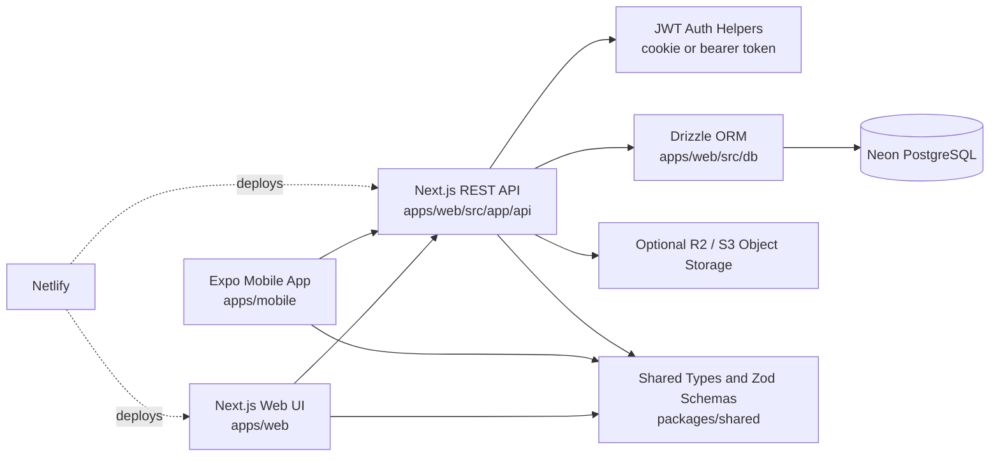
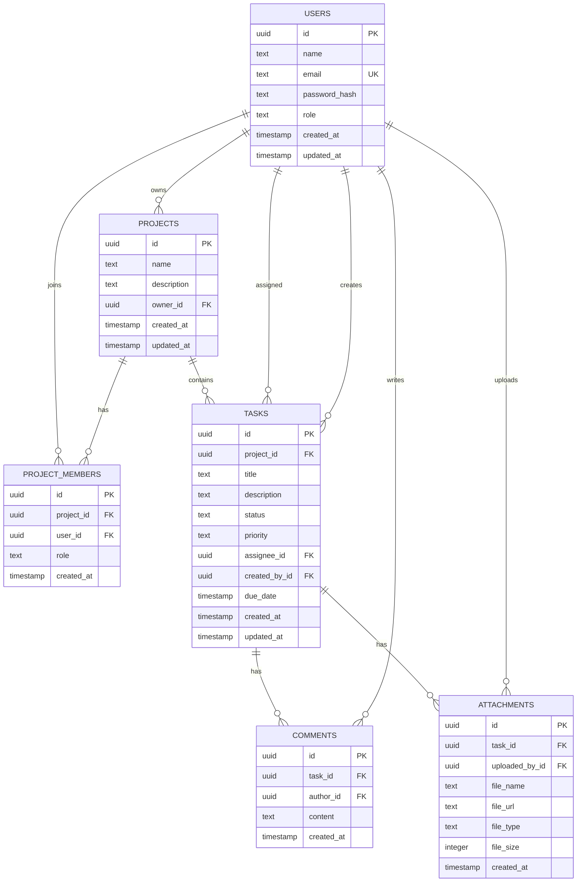

# TaskFlow

TaskFlow is a multi-platform project and issue tracking system built for a university capstone project. It helps teams organize projects, assign tasks, track progress, discuss work through comments, upload task attachments, and administer users from a shared web and mobile experience.

The repository contains a Next.js web application, a Next.js REST API backend, an Expo mobile client, shared TypeScript contracts, Drizzle ORM schema and migrations, and deployment documentation for Netlify and Neon PostgreSQL.

## Live Demo

```text
Netlify demo URL: https://your-taskflow-demo.netlify.app
```

Demo credentials:

```text
Admin:
admin@taskflow.dev
admin123

User:
demo@taskflow.dev
demo123
```

## Features

- Email and password registration and login.
- JWT authentication for web and mobile clients.
- Web JWT storage through secure httpOnly cookies.
- Mobile JWT storage through Expo SecureStore.
- Role-based access control with `admin`, `manager`, and `user` roles.
- Project creation, listing, detail, update, and deletion.
- Project membership records for user access control.
- Task creation, assignment, status tracking, priority tracking, due dates, updates, and deletion.
- Web task board views grouped by status, with drag-and-drop cards for moving tasks between workflow columns.
- Task comments for project collaboration.
- Task attachment uploads with metadata stored in PostgreSQL and files stored in an S3-compatible object store such as Cloudflare R2.
- Admin user search, user list, and role management.
- Shared TypeScript types and Zod validation contracts for API input.
- Web dashboard and Expo mobile client that both consume the same REST API.

## User Roles

- `admin`: Can view and manage all projects, list users, update user roles, delete user accounts, and delete any project. Admins still authenticate through the same JWT flow as normal users.
- `manager`: Can create projects, manage members in projects they own or manage, and create tasks in accessible projects.
- `user`: Can work only on assigned projects and tasks, including viewing accessible project tasks, updating accessible tasks, commenting on accessible tasks, and uploading attachments to accessible tasks.

## Technology Stack

- Monorepo: npm workspaces.
- Language: TypeScript.
- Web frontend: Next.js App Router, React, Tailwind CSS.
- Backend API: Next.js Route Handlers in `apps/web/src/app/api`.
- Mobile client: Expo, React Native, Expo Router.
- Shared contracts: `packages/shared`, Zod, TypeScript types.
- Database: Neon PostgreSQL.
- ORM and migrations: Drizzle ORM and Drizzle Kit.
- Authentication: JWT, bcrypt password hashing.
- Web deployment: Netlify with `@netlify/plugin-nextjs`.
- Object storage: Cloudflare R2 or another S3-compatible storage service for task attachments.

## Capstone Requirement Checklist

| Requirement | Status | Evidence |
| --- | --- | --- |
| Backend API with Next.js and PostgreSQL | Complete | Next.js Route Handlers in `apps/web/src/app/api` use Drizzle against PostgreSQL. |
| Neon serverless PostgreSQL | Complete | Neon serverless client is configured in `apps/web/src/db/index.ts`. |
| Drizzle ORM and migrations | Complete | Schema lives in `apps/web/src/db/schema.ts`; committed migration files live in `apps/web/drizzle`. |
| Web app with Next.js, React, TypeScript, Tailwind | Complete | Web workspace is `apps/web` with App Router, React components, TypeScript, and Tailwind CSS. |
| Mobile app with React Native and Expo | Complete | Expo Router app lives in `apps/mobile`. |
| RESTful API communication | Complete | Web and mobile clients call `/api/...` JSON REST endpoints with shared envelopes. |
| Monorepo structure | Complete | npm workspaces cover `apps/web`, `apps/mobile`, and `packages/shared`. |
| Netlify deployment | Complete | `netlify.toml` deploys `apps/web` with `@netlify/plugin-nextjs`. |
| JWT authentication | Complete | JWT helpers live in `apps/web/src/lib/auth.ts`; web uses an httpOnly cookie and mobile uses bearer tokens. |
| Register, login, logout | Complete | Implemented under `/api/auth/register`, `/api/auth/login`, `/api/auth/logout`, plus web and mobile screens. |
| Global user roles | Complete | Shared role enum supports `admin`, `manager`, and `user`; server routes enforce authorization. |
| Admin user management | Complete | User management lives at `apps/web/src/app/dashboard/users`. |
| Minimum 5 screens | Complete | Web and mobile together include login, register, dashboard, project list, project details, task details, task creation, task status, and admin screens. |
| Minimum 4 database tables | Complete | The schema includes users, projects, project members, tasks, comments, and attachments. |
| Relationships and indexes | Complete | Foreign keys and indexes are documented in `docs/DATABASE.md` and defined in `apps/web/src/db/schema.ts`. |
| Documentation in repository | Complete | Documentation lives in `README.md` and `docs/`. |
| AGENTS.md file | Complete | `AGENTS.md` is present at the repository root. |
| Demo credentials | Complete | Seeded demo accounts are listed below and in setup/deployment docs. |
| Deployment guide | Complete | Netlify and Neon deployment steps are in `docs/DEPLOYMENT.md`. |
| 15+ commits over 3+ days | Complete | Current history has more than 15 commits spanning May 4, May 5, May 8, and May 9, 2026. |

## Architecture



The web application and backend API are deployed together to Netlify. The mobile app is an API client and calls the deployed Netlify API in production through `EXPO_PUBLIC_API_URL`; it never connects directly to Neon.

## Database ER Diagram



## API Overview

All REST API routes live under `apps/web/src/app/api` and are served from `/api/...`.

Successful responses use:

```json
{
  "data": {}
}
```

Error responses use:

```json
{
  "error": {
    "message": "Invalid request body."
  }
}
```

Main route groups:

- Health: `GET /api/health`
- Auth: `POST /api/auth/register`, `POST /api/auth/login`, `POST /api/auth/logout`, `GET /api/auth/me`, `PATCH /api/auth/password`
- Users: `GET /api/users?search=`, `GET/PATCH/DELETE /api/users/:id`
- Projects: `GET /api/projects`, `POST /api/projects`, `GET/PATCH/DELETE /api/projects/:id`
- Tasks: `GET/POST /api/projects/:id/tasks`, `GET/POST /api/tasks`, `GET/PATCH/DELETE /api/tasks/:taskId`
- Comments: `GET/POST /api/tasks/:taskId/comments`, `DELETE /api/comments/:commentId`
- Attachments: `GET/POST /api/tasks/:taskId/attachments`
- Admin: `GET /api/admin/stats`, `GET /api/admin/users`, `PATCH /api/admin/users/:id/role`, `GET /api/admin/projects`, `DELETE /api/admin/projects/:id`

Web requests authenticate with the `taskflow_token` httpOnly cookie. Mobile requests authenticate with:

```text
Authorization: Bearer <token>
```

See [API documentation](docs/API.md) for request examples, response examples, and authorization rules.

## Local Setup

Prerequisites:

- Node.js 20 or newer.
- npm 10 or newer.
- Neon PostgreSQL database.
- Expo Go or a local iOS/Android simulator for mobile development.

Install dependencies:

```bash
npm install
```

Create `apps/web/.env.local`:

```text
DATABASE_URL=<local-or-neon-postgres-url>
JWT_SECRET=<local-development-secret>
NEXT_PUBLIC_API_URL=http://localhost:3000
NODE_ENV=development

# Optional: production-only CORS origin if you deploy the Expo Web preview separately.
MOBILE_WEB_ORIGIN=https://your-mobile-web-preview.example.com

# Required only when testing attachment uploads:
R2_ACCOUNT_ID=<cloudflare-account-id>
R2_ACCESS_KEY_ID=<r2-access-key-id>
R2_SECRET_ACCESS_KEY=<r2-secret-access-key>
R2_BUCKET_NAME=<r2-bucket-name>
R2_PUBLIC_URL=https://files.example.com
```

Create `apps/mobile/.env`:

```text
EXPO_PUBLIC_API_URL=http://localhost:3000
```

For a physical phone, replace `localhost` with your computer LAN IP, for example:

```text
EXPO_PUBLIC_API_URL=http://192.168.2.100:3000
```

Apply migrations and seed demo data:

```bash
npm run db:migrate -w @taskflow/web
npm run db:seed
```

Run the web app and Expo mobile dev server together:

```bash
npm run dev
```

Run only the web app:

```bash
npm run dev:web
```

Run the mobile app:

```bash
npm run dev:mobile
```

Run the mobile app in a browser with Expo Web:

```bash
npm run dev:mobile:web
```

The combined `npm run dev` command and the Expo Web command automatically use the next available Expo port if `8081` is already busy. Set `TASKFLOW_MOBILE_PORT` to choose a different starting port.

The Expo Web preview uses `EXPO_PUBLIC_API_URL` for API calls, just like the Android and iOS clients.

Type-check all workspaces:

```bash
npm run typecheck
```

## Netlify Deployment

TaskFlow deploys the web frontend and REST API from `apps/web` to Netlify. The root `netlify.toml` contains the production build settings:

```toml
[build]
  command = "npm run build --workspace apps/web"
  publish = "apps/web/.next"

[build.environment]
  NPM_FLAGS = "--include=dev"
  NODE_VERSION = "20"

[[plugins]]
  package = "@netlify/plugin-nextjs"
```

Configure these Netlify environment variables:

```text
DATABASE_URL=<production-neon-postgres-url>
JWT_SECRET=<strong-production-secret>
NEXT_PUBLIC_API_URL=https://your-taskflow-demo.netlify.app
MOBILE_WEB_ORIGIN=https://your-mobile-web-preview.example.com
NODE_ENV=production
R2_ACCOUNT_ID=<cloudflare-account-id>
R2_ACCESS_KEY_ID=<r2-access-key-id>
R2_SECRET_ACCESS_KEY=<r2-secret-access-key>
R2_BUCKET_NAME=<r2-bucket-name>
R2_PUBLIC_URL=https://files.example.com
```

Run production migrations intentionally against the production database after reviewing committed Drizzle migrations:

```bash
DATABASE_URL="production_neon_url" npm run db:migrate -w @taskflow/web
DATABASE_URL="production_neon_url" npm run db:seed
```

PowerShell users can set `$env:DATABASE_URL="production_neon_url"` first, then run the same `npm` commands without the inline environment prefix.

Configure production mobile builds with:

```text
EXPO_PUBLIC_API_URL=https://your-taskflow-demo.netlify.app
```

Never expose `DATABASE_URL`, `JWT_SECRET`, or R2 credentials to browser JavaScript or the mobile app.

## Key Folders And Files

```text
apps/web/src/app/                     Next.js App Router pages and layouts
apps/web/src/app/api/                 REST API Route Handlers
apps/web/src/components/              Web UI components
apps/web/src/components/admin/        Admin user-management components
apps/web/src/components/projects/     Project web UI components
apps/web/src/components/tasks/        Task, comment, and attachment web UI components
apps/web/src/db/schema.ts             Drizzle database schema
apps/web/src/db/seed.ts               Idempotent demo seed script
apps/web/drizzle/                     Generated Drizzle migrations
apps/web/src/lib/auth.ts              JWT, cookie, password, and auth helper logic
apps/web/src/lib/r2-storage.ts        S3-compatible R2 upload helper
apps/mobile/src/app/                  Expo Router screens
apps/mobile/src/lib/api.ts            Typed mobile API client
apps/mobile/src/lib/auth-storage.ts   SecureStore token persistence
packages/shared/src/index.ts          Shared enums, types, constants, and Zod schemas
docs/                                Capstone project documentation
netlify.toml                         Netlify build and Next.js runtime configuration
```

## Documentation

- [Architecture](docs/ARCHITECTURE.md)
- [Database](docs/DATABASE.md)
- [API](docs/API.md)
- [Setup](docs/SETUP.md)
- [Deployment](docs/DEPLOYMENT.md)
- [Screenshots](docs/SCREENSHOTS.md)
