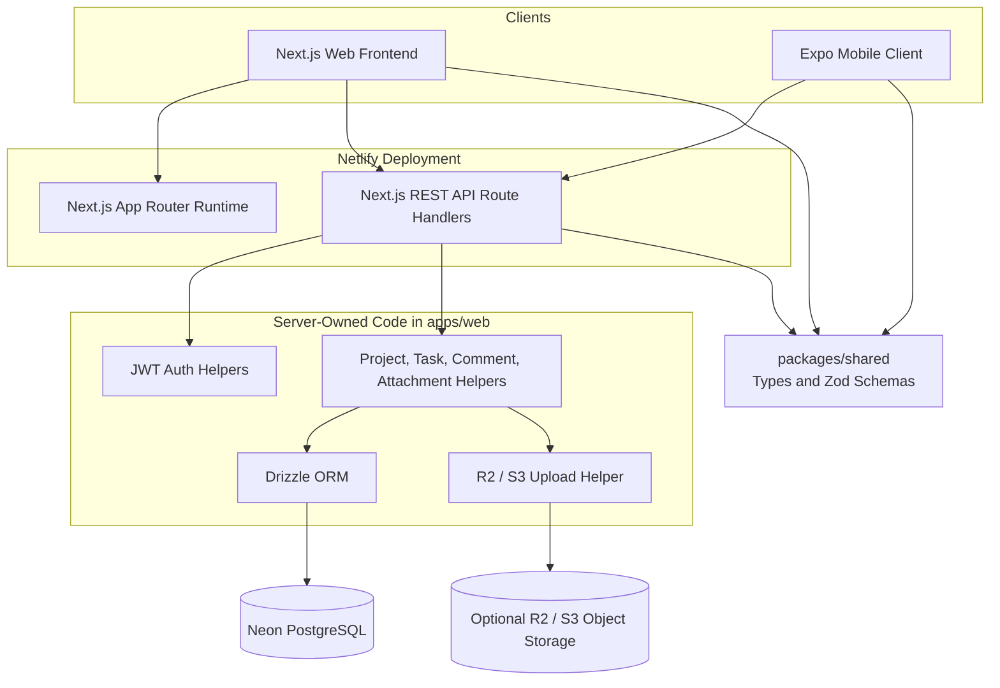
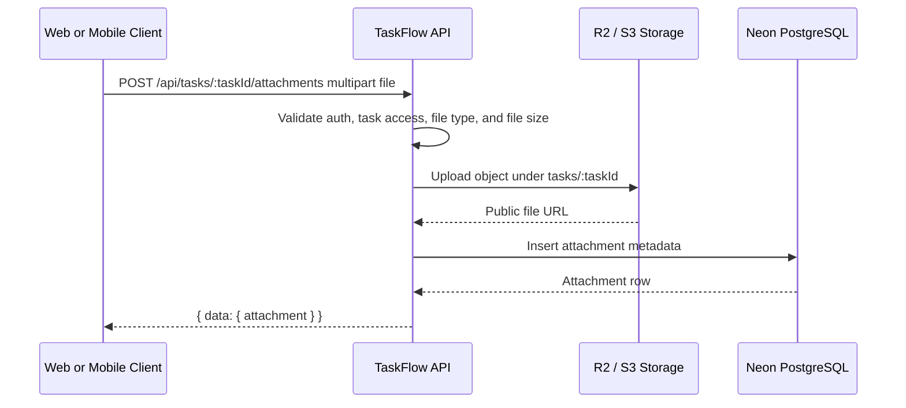

# Architecture

TaskFlow is an npm workspace monorepo for a university capstone project and issue tracking system. The system is split into web, API, mobile, shared contracts, documentation, and database migration boundaries so each platform has a clear responsibility.

## Monorepo Structure

```text
apps/
  web/
    src/
      app/
        api/
      components/
      db/
      lib/
    drizzle/
  mobile/
    src/
      app/
      components/
      lib/
packages/
  shared/
    src/
docs/
```

- `apps/web` owns the Next.js web frontend, REST API Route Handlers, server-side authentication, Drizzle ORM database access, seed script, and attachment storage integration.
- `apps/mobile` owns the Expo React Native client, Expo Router screens, API client calls, and SecureStore token handling.
- `packages/shared` owns platform-neutral TypeScript types, enums, constants, and Zod validation schemas.
- `docs` owns architecture, setup, database, API, deployment, and screenshots documentation.

The mobile app and shared package must not import server-only code, Drizzle schema, database clients, JWT secrets, or object storage credentials from the web app.

## System Diagram



## Next.js Web Frontend

The web frontend lives in `apps/web` and uses the Next.js App Router. Public authentication pages live under `apps/web/src/app/login` and `apps/web/src/app/register`. Authenticated web pages share the layout in `apps/web/src/app/(app)` and are served through clean URLs such as `/dashboard`, `/projects`, `/users`, and `/profile`.

The web UI uses Tailwind CSS and focused component folders:

- `components/auth` for login and registration forms.
- `components/projects` for project list, details, and project creation UI.
- `components/tasks` for task cards, task board columns, task forms, comments, and attachments.
- `components/admin` for admin statistics, user management, and project administration.
- `components/ui` for reusable UI primitives.

Web authentication is cookie-based. Successful login and registration set a `taskflow_token` httpOnly cookie. Browser JavaScript does not need direct access to the JWT.

## Next.js REST API Backend

The backend is implemented with Next.js Route Handlers in `apps/web/src/app/api`. API routes are deployed with the web app and are available under `/api/...`.

Implemented route areas:

- `auth`: register, login, logout, and current-user lookup.
- `projects`: project list, creation, detail, update, and deletion.
- `tasks`: project task list, task creation, task detail, update, and deletion.
- `comments`: task comments and comment deletion.
- `attachments`: task attachment listing and upload.
- `admin`: stats, user list, user role update, project list, and project deletion.
- `health`: deployment smoke check.

API handlers validate request bodies and route parameters with shared Zod schemas where appropriate. Responses use consistent JSON envelopes:

```json
{
  "data": {}
}
```

```json
{
  "error": {
    "message": "Invalid request body."
  }
}
```

## Netlify Deployment

Netlify deploys `apps/web`, including the App Router frontend and API Route Handlers. The root `netlify.toml` configures:

```toml
[build]
  command = "npm run build --workspace apps/web"
  publish = "apps/web/.next"

[build.environment]
  NPM_FLAGS = "--include=dev"
  NODE_VERSION = "20"

[[plugins]]
  package = "@netlify/plugin-nextjs"
```

Netlify stores production server-only environment variables such as `DATABASE_URL`, `JWT_SECRET`, and R2 credentials. These values must not be committed or exposed to browser or mobile bundles.

## Expo Mobile Client

The mobile app lives in `apps/mobile` and uses Expo, React Native, and Expo Router. Screens include login, registration, dashboard, project list, project details, task creation, task details, and task status updates. Authenticated mobile screens are grouped under an Expo Router tabs layout so Home, Projects, Users for admins, and Profile share native bottom tab navigation.

The mobile API client lives in `apps/mobile/src/lib/api.ts`. It reads the API base URL from:

```text
EXPO_PUBLIC_API_URL
```

In local development this can point to `http://localhost:3000` for simulators or to a LAN IP for physical devices. In production it points to the deployed Netlify site.

## Mobile Calling Netlify API

The mobile app is an API client only. It never connects directly to Neon PostgreSQL and never imports Drizzle or server-side web modules. In production, all mobile data access flows through:

```text
Expo app -> HTTPS -> Netlify /api routes -> Drizzle -> Neon PostgreSQL
```

Mobile authentication uses the JWT returned by `/api/auth/login` or `/api/auth/register`, stored through Expo SecureStore, and sent as:

```text
Authorization: Bearer <token>
```

## JWT Authentication Flow

1. A user registers or logs in through the web app or mobile app.
2. The API validates the request body and verifies credentials when logging in.
3. Passwords are hashed with bcrypt before storage.
4. The API signs a JWT containing the user id in `sub` and the user role.
5. Web responses set the JWT in the `taskflow_token` httpOnly cookie.
6. Mobile responses include the JWT in the JSON payload so the app can store it in SecureStore.
7. Protected API routes call auth helpers that read a bearer token first, then fall back to the web cookie.
8. API handlers derive the acting user from the verified JWT and enforce authorization on the server.

JWT cookies are configured with `httpOnly`, `sameSite: "lax"`, path `/`, a seven-day max age, and `secure` in production.

## Authorization Model

TaskFlow supports three global user roles:

- `admin`: Can access admin routes and manage all users and projects.
- `manager`: Can create projects and create tasks in projects they can access.
- `user`: Can work only on assigned projects and tasks.

Project membership roles stay separate from global roles. Membership controls access to specific projects, while the global role controls system-level permissions.

Server-side authorization is enforced by API handlers and helper functions. UI controls may hide actions for usability, but authorization does not rely on hidden buttons or mobile navigation.

## Neon PostgreSQL

Neon PostgreSQL is the persistent database. Only server-side code in `apps/web` reads `DATABASE_URL` and connects to Neon. The schema stores users, projects, project members, tasks, comments, and attachment metadata.

## Drizzle ORM

Drizzle ORM schema definitions live in `apps/web/src/db/schema.ts`. The database client lives in `apps/web/src/db/index.ts`. Generated migrations live in `apps/web/drizzle`.

Schema changes must be represented by committed Drizzle migrations. Production migrations should be reviewed and run intentionally against the production Neon database; they should not be hidden inside every Netlify build.

## Optional Object Storage Flow

Task attachments use an optional S3-compatible storage flow. The API validates uploaded files, uploads file bytes to Cloudflare R2 or a compatible object store, and stores only metadata in PostgreSQL.



Supported upload categories are images, PDF files, and selected text formats up to 10 MB. If R2 environment variables are not configured, upload requests return a storage configuration error.
