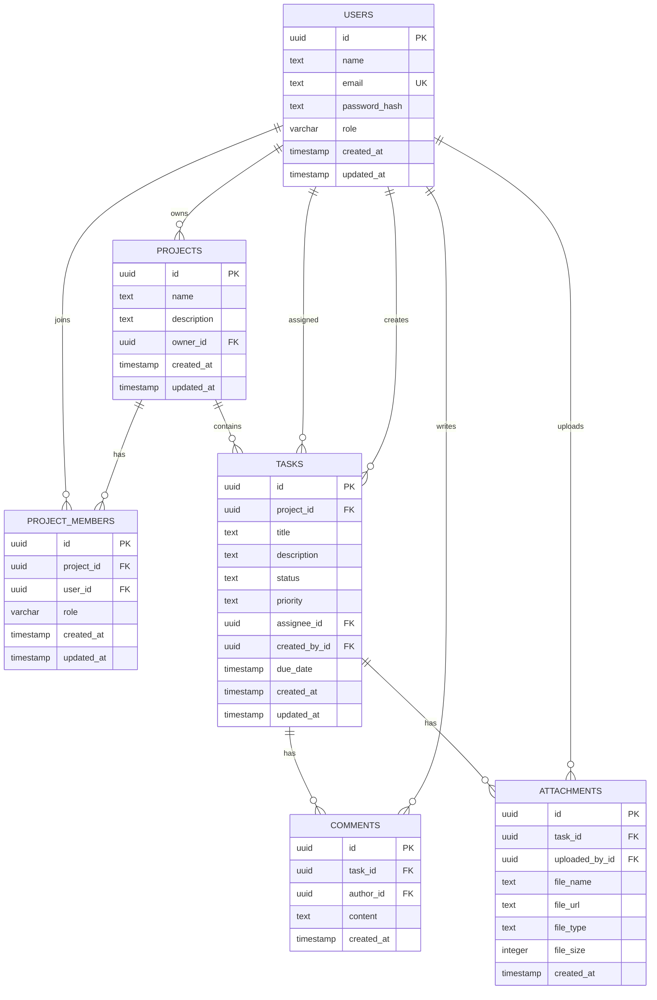

# Database

TaskFlow uses Neon PostgreSQL with Drizzle ORM. Database schema, migrations, database client code, and seed data are owned by `apps/web`. The Expo mobile app and `packages/shared` do not connect to PostgreSQL directly.

## Files

```text
apps/web/src/db/schema.ts             Drizzle table definitions
apps/web/src/db/index.ts              Neon serverless Drizzle client
apps/web/src/db/seed.ts               Idempotent demo seed script
apps/web/drizzle.config.ts            Drizzle Kit configuration
apps/web/drizzle/0000_*.sql           Generated migration SQL
apps/web/drizzle/meta/                Drizzle migration metadata
```

## Tables

### `users`

Stores user identity, authentication data, and the global system role.

| Column | Type | Notes |
| --- | --- | --- |
| `id` | `uuid` | Primary key, default `gen_random_uuid()`. |
| `name` | `text` | Required display name. |
| `email` | `text` | Required, unique index. Stored lowercase by auth routes. |
| `password_hash` | `text` | Required bcrypt hash. Never returned by API responses. |
| `role` | `varchar(24)` | Required global system role, default `user`. Allowed values are `admin`, `manager`, and `user`. |
| `created_at` | `timestamp` | Defaults to `now()`. |
| `updated_at` | `timestamp` | Defaults to `now()`. Updated by application code. |

### `projects`

Stores top-level workspaces for tasks and collaboration.

| Column | Type | Notes |
| --- | --- | --- |
| `id` | `uuid` | Primary key, default `gen_random_uuid()`. |
| `name` | `text` | Required project name. |
| `description` | `text` | Optional project description. |
| `owner_id` | `uuid` | Foreign key to `users.id`. Application expects an owner. |
| `created_at` | `timestamp` | Defaults to `now()`. |
| `updated_at` | `timestamp` | Defaults to `now()`. Updated by application code. |

### `project_members`

Stores user access to projects.

| Column | Type | Notes |
| --- | --- | --- |
| `id` | `uuid` | Primary key, default `gen_random_uuid()`. |
| `project_id` | `uuid` | Required foreign key to `projects.id`, cascades on project deletion. |
| `user_id` | `uuid` | Required foreign key to `users.id`, cascades on user deletion. |
| `role` | `varchar(24)` | Required role value, default `member`. Allowed values are `owner`, `manager`, and `member`. |
| `created_at` | `timestamp` | Required, defaults to `now()`. |
| `updated_at` | `timestamp` | Required, defaults to `now()`. Updated by application code. |

### `tasks`

Stores project work items and issue tracking records.

| Column | Type | Notes |
| --- | --- | --- |
| `id` | `uuid` | Primary key, default `gen_random_uuid()`. |
| `project_id` | `uuid` | Foreign key to `projects.id`, cascades on project deletion. |
| `title` | `text` | Required task title. |
| `description` | `text` | Optional task details. |
| `status` | `text` | Required application enum value, default `todo`. |
| `priority` | `text` | Required application enum value, default `medium`. |
| `assignee_id` | `uuid` | Optional foreign key to `users.id`. |
| `created_by_id` | `uuid` | Foreign key to `users.id`. Application sets this from the authenticated user. |
| `due_date` | `timestamp` | Optional due date. |
| `created_at` | `timestamp` | Defaults to `now()`. |
| `updated_at` | `timestamp` | Defaults to `now()`. Updated by application code. |

### `comments`

Stores discussion entries for tasks.

| Column | Type | Notes |
| --- | --- | --- |
| `id` | `uuid` | Primary key, default `gen_random_uuid()`. |
| `task_id` | `uuid` | Foreign key to `tasks.id`, cascades on task deletion. |
| `author_id` | `uuid` | Foreign key to `users.id`. |
| `content` | `text` | Required comment content. |
| `created_at` | `timestamp` | Defaults to `now()`. |

### `attachments`

Stores metadata for files uploaded to tasks. File bytes are stored outside PostgreSQL in R2 or another S3-compatible object store.

| Column | Type | Notes |
| --- | --- | --- |
| `id` | `uuid` | Primary key, default `gen_random_uuid()`. |
| `task_id` | `uuid` | Foreign key to `tasks.id`, cascades on task deletion. |
| `uploaded_by_id` | `uuid` | Foreign key to `users.id`. |
| `file_name` | `text` | Required original file name after validation. |
| `file_url` | `text` | Required public object URL. |
| `file_type` | `text` | MIME type resolved by upload validation. |
| `file_size` | `integer` | File size in bytes. |
| `created_at` | `timestamp` | Defaults to `now()`. |

## Relationships

- A user can own many projects through `projects.owner_id`.
- A user can belong to many projects through `project_members.user_id`.
- A project can have many members through `project_members.project_id`.
- A project can have many tasks through `tasks.project_id`.
- A user can be assigned many tasks through `tasks.assignee_id`.
- A user can create many tasks through `tasks.created_by_id`.
- A task can have many comments through `comments.task_id`.
- A user can write many comments through `comments.author_id`.
- A task can have many attachments through `attachments.task_id`.
- A user can upload many attachments through `attachments.uploaded_by_id`.

Cascade behavior:

- Deleting a project cascades to its project members and tasks.
- Deleting a task cascades to its comments and attachment metadata.
- Deleting a user cascades project membership records, but does not cascade owned projects, assigned tasks, created tasks, comments, or attachment metadata.

## Indexes And Constraints

| Index/Constraint | Table | Columns | Purpose |
| --- | --- | --- | --- |
| `users_email_idx` | `users` | `email` | Unique login and registration lookup. |
| `users_role_check` | `users` | `role` | Restricts global user roles to `admin`, `manager`, and `user`. |
| `projects_owner_id_idx` | `projects` | `owner_id` | Project ownership and authorization checks. |
| `project_members_project_id_idx` | `project_members` | `project_id` | Project member lookup. |
| `project_members_user_id_idx` | `project_members` | `user_id` | User project list and authorization checks. |
| `project_members_project_id_user_id_unique` | `project_members` | `project_id`, `user_id` | Prevents assigning the same user to a project more than once. |
| `project_members_role_check` | `project_members` | `role` | Restricts member roles to `owner`, `manager`, and `member`. |
| `tasks_project_id_idx` | `tasks` | `project_id` | Task board and project task list queries. |
| `tasks_assignee_id_idx` | `tasks` | `assignee_id` | Assignment-based filtering and checks. |
| `tasks_status_idx` | `tasks` | `status` | Status grouping for boards and admin stats. |
| `comments_task_id_idx` | `comments` | `task_id` | Task comment list queries. |
| `attachments_task_id_idx` | `attachments` | `task_id` | Task attachment list queries. |

## Enums

Most enum-like values are stored as `text` columns and validated at the application layer through `packages/shared`. Global user roles and project member roles are stored as `varchar(24)` and also enforced with database check constraints.

### User roles

```text
admin
manager
user
```

### Project member roles

```text
owner
member
manager
```

### Task statuses

```text
todo
in_progress
done
```

### Task priorities

```text
low
medium
high
```

## Mermaid ER Diagram



## Migration Process

Drizzle migrations are generated from `apps/web/src/db/schema.ts` and committed under `apps/web/drizzle`.

Generate a migration after schema changes:

```bash
npm run db:generate -w @taskflow/web
```

Apply migrations to the configured database:

```bash
npm run db:migrate -w @taskflow/web
```

Open Drizzle Studio during development:

```bash
npm run db:studio -w @taskflow/web
```

Seed demo users and sample capstone data:

```bash
npm run db:seed
```

The seed creates:

```text
admin@taskflow.dev / admin123
demo@taskflow.dev / demo123
```

Production migrations should be reviewed before execution and run intentionally against the production Neon database. Do not manually edit production tables outside committed migrations.
